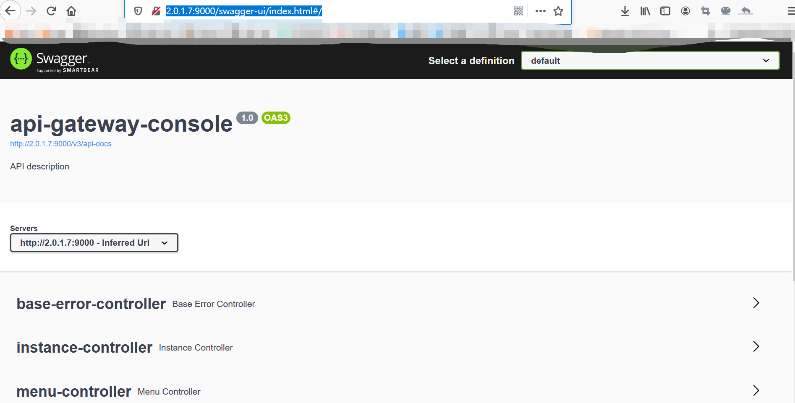

# commons-springfox-starter

## 1. Swagger-ui 3.0

### 1) 添加依赖

```
	<dependency>
		<groupId>org.micro</groupId>
		<artifactId>common-springfox-starter</artifactId>
		<version>${common.version}</version>
	</dependency>

```

### 2) 修改application.yml配置

```
# swagger
springfox:
  documentation:
    enabled: true
    base-apis-package: com.xxx.xxx.gateway.controller
    
```

### 3) 添加注解

```
@EnableSpringfox
@Configuration
public class AppConfig {

}

```

### 4) 启动服务访问

http://2.0.1.7:9000/swagger-ui/index.html#/

